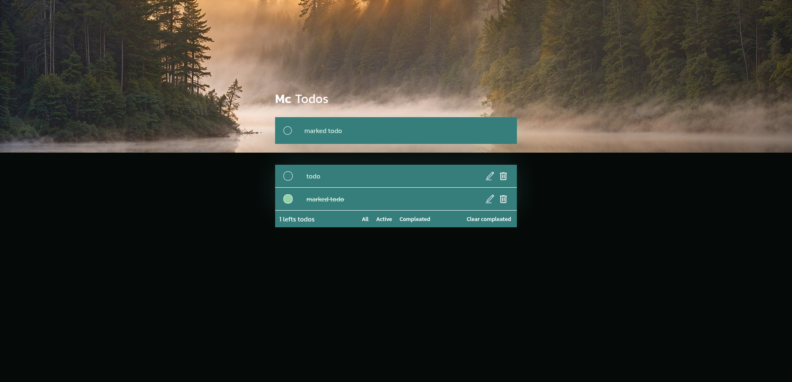

# To-Do App

This project is a simple To-Do application built with **React**, **TypeScript**, and **Sass**. The main goal of this project is to gain a deeper understanding of TypeScript in React while building a functional, minimalistic to-do list app.

## Table of Contents

- [Features](#features)
- [Images](#images)
- [Technologies Used](#technologies-used)
- [Installation](#installation)
- [TypeScript Concepts Covered](#typescript-concepts-covered)
- [License](#license)
- [Contact](#contact)

## Features

- **Add Tasks**: Add new tasks to the list.
- **Edit Tasks**: Modify existing tasks in the list.
- **Remove Tasks**: Delete tasks from the list.
- **Mark as Complete**: Mark tasks as completed or incomplete.
- **Delete Completed Tasks**: Remove all tasks that have been marked as completed.
- **Filter Tasks**: Filter tasks to view all, active, or completed tasks.
- **Task Counter**: Display the number of tasks left to do.

## Images

Below are a screenshot of the app in action:

**Main Interface**:
   

## Technologies Used

- **React**: A JavaScript library for building user interfaces.
- **TypeScript**: A superset of JavaScript that adds static typing, enhancing the development experience.
- **Sass (Syntactically Awesome Style Sheets)**: A CSS preprocessor for more modular, maintainable, and reusable styles.

## Installation

To get started with the project, follow these steps:

1. **Clone the repository**:
   ```bash
   git clone https://github.com/mccartheney/todo_app-typescript-and-react
   cd todo-app
   ```

2. **Install dependencies**:
   ```bash
   npm install
   ```

3. **Run the application**:
   ```bash
   npm start
   ```

This will run the app in development mode, and you can view it in your browser at [http://localhost:3000](http://localhost:3000).

## TypeScript Concepts Covered

This project covers several important **TypeScript** concepts, including:

- **Type Inference**: How TypeScript infers types from code context.
- **Interfaces and Types**: Defining types and interfaces for component props, state, and reusable objects.
- **React with TypeScript**: Using TypeScript for functional components, hooks, and managing the component state.
- **Typing Events**: Handling typed events such as form inputs and button clicks.
- **Optional and Default Props**: Understanding optional and default props with TypeScript.


## License

This project is licensed under the MIT License.


## Contact

Feel free to reach out if you have any questions or would like to connect!

- **Email:** [mccartheney@hotmail.com](mccartheney@hotmail.com)
- **LinkedIn:** [Mccartheney Mendes](https://www.linkedin.com/in/mccartheney-mendes-892709292/)
- **GitHub:** [mccartheney](https://github.com/mccartheney)
